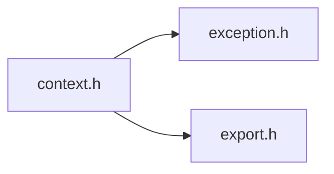

# File context.h

![][C++]

**Location**: `context.h`


## Classes

* [f3d::context](classf3d_1_1context.md)
* [f3d::context::loading\_exception](structf3d_1_1context_1_1loading__exception.md)
* [f3d::context::symbol\_exception](structf3d_1_1context_1_1symbol__exception.md)

## Namespaces

* [f3d](namespacef3d.md)

## Includes

* [exception.h](exception_8h.md)
* export.h





## Included by

* [engine.h](engine_8h.md)


## Source


```cpp
#ifndef f3d_context_h
#define f3d_context_h

#include "exception.h"
#include "export.h"

#include <functional>
#include <string>

namespace f3d
{
class F3D_EXPORT context
{
public:
  using fptr = void (*)();
  using function = std::function<fptr(const char*)>;

  [[nodiscard]] static function glx();

  [[nodiscard]] static function wgl();

  [[nodiscard]] static function cocoa();

  [[nodiscard]] static function egl();

  [[nodiscard]] static function osmesa();

  [[nodiscard]] static function getSymbol(std::string_view lib, std::string_view func);

  struct loading_exception : public exception
  {
    explicit loading_exception(const std::string& what = "");
  };

  struct symbol_exception : public exception
  {
    explicit symbol_exception(const std::string& what = "");
  };
};
}

#endif
```


[public]: https://img.shields.io/badge/-public-brightgreen (public)
[C++]: https://img.shields.io/badge/language-C%2B%2B-blue (C++)
[const]: https://img.shields.io/badge/-const-lightblue (const)
[protected]: https://img.shields.io/badge/-protected-yellow (protected)
[static]: https://img.shields.io/badge/-static-lightgrey (static)
[private]: https://img.shields.io/badge/-private-red (private)