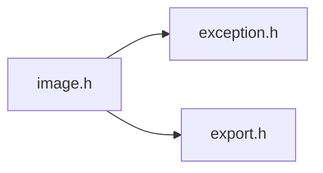
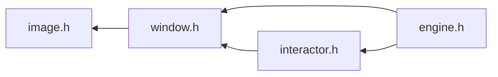

# File image.h

![][C++]

**Location**: `image.h`


## Classes

* [f3d::image](classf3d_1_1image.md)
* [f3d::image::write\_exception](structf3d_1_1image_1_1write__exception.md)
* [f3d::image::read\_exception](structf3d_1_1image_1_1read__exception.md)
* [f3d::image::metadata\_exception](structf3d_1_1image_1_1metadata__exception.md)

## Namespaces

* [f3d](namespacef3d.md)

## Includes

* [exception.h](exception_8h.md)
* export.h





## Included by

* [window.h](window_8h.md)





## Source


```cpp
#ifndef f3d_image_h
#define f3d_image_h

#include "exception.h"
#include "export.h"

#include <filesystem>
#include <string>
#include <vector>

namespace f3d
{
class F3D_EXPORT image
{
public:
  enum class SaveFormat : unsigned char
  {
    PNG,
    JPG,
    TIF,
    BMP
  };

  enum class ChannelType : unsigned char
  {
    BYTE,
    SHORT,
    FLOAT
  };

  explicit image(const std::filesystem::path& filePath);

  image(unsigned int width, unsigned int height, unsigned int channelCount,
    ChannelType type = ChannelType::BYTE);


  image();
  ~image();
  image(const image& img);
  image& operator=(const image& img) noexcept;
  image(image&& img) noexcept;
  image& operator=(image&& img) noexcept;


  [[nodiscard]] bool operator==(const image& reference) const;
  [[nodiscard]] bool operator!=(const image& reference) const;

  [[nodiscard]] std::vector<double> getNormalizedPixel(const std::pair<int, int>& xy) const;

  [[nodiscard]] static std::vector<std::string> getSupportedFormats();


  [[nodiscard]] unsigned int getWidth() const;
  [[nodiscard]] unsigned int getHeight() const;


  [[nodiscard]] unsigned int getChannelCount() const;

  [[nodiscard]] ChannelType getChannelType() const;

  [[nodiscard]] unsigned int getChannelTypeSize() const;


  image& setContent(void* buffer);
  [[nodiscard]] void* getContent() const;

  double compare(const image& reference) const;

  const image& save(
    const std::filesystem::path& filePath, SaveFormat format = SaveFormat::PNG) const;

  [[nodiscard]] std::vector<unsigned char> saveBuffer(SaveFormat format = SaveFormat::PNG) const;

  const image& toTerminalText(std::ostream& stream) const;

  [[nodiscard]] std::string toTerminalText() const;

  f3d::image& setMetadata(std::string key, std::string value);

  [[nodiscard]] std::string getMetadata(const std::string& key) const;

  [[nodiscard]] std::vector<std::string> allMetadata() const;

  struct write_exception : public exception
  {
    explicit write_exception(const std::string& what = "");
  };

  struct read_exception : public exception
  {
    explicit read_exception(const std::string& what = "");
  };

  struct metadata_exception : public exception
  {
    explicit metadata_exception(const std::string& what = "");
  };

private:
  class internals;
  internals* Internals;
};
}

#endif
```


[public]: https://img.shields.io/badge/-public-brightgreen (public)
[C++]: https://img.shields.io/badge/language-C%2B%2B-blue (C++)
[const]: https://img.shields.io/badge/-const-lightblue (const)
[protected]: https://img.shields.io/badge/-protected-yellow (protected)
[static]: https://img.shields.io/badge/-static-lightgrey (static)
[private]: https://img.shields.io/badge/-private-red (private)