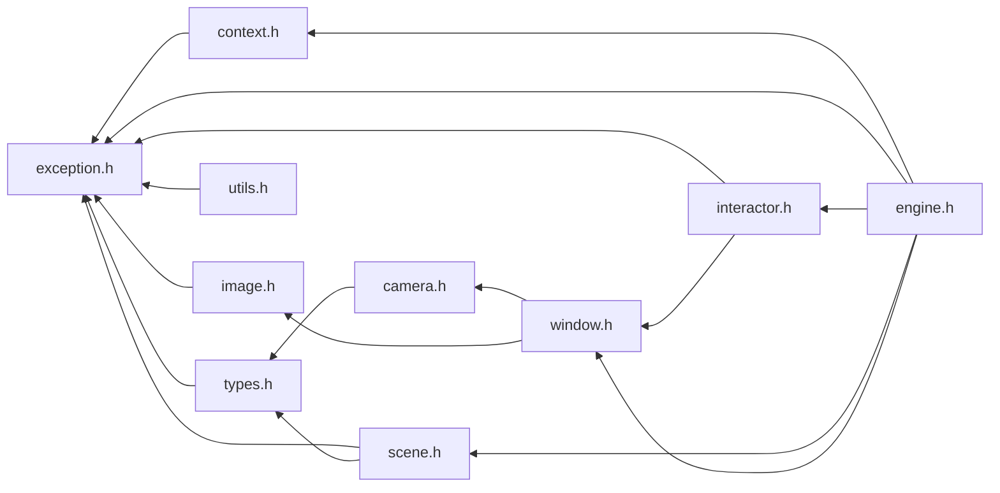

# File exception.h

![][C++]

**Location**: `exception.h`


## Classes

* [f3d::exception](structf3d_1_1exception.md)

## Namespaces

* [f3d](namespacef3d.md)

## Included by

* [context.h](context_8h.md)
* [engine.h](engine_8h.md)
* [image.h](image_8h.md)
* [interactor.h](interactor_8h.md)
* [scene.h](scene_8h.md)
* [types.h](types_8h.md)
* [utils.h](utils_8h.md)





## Source


```cpp
#ifndef f3d_exception_h
#define f3d_exception_h

#include <stdexcept>
#include <string>

namespace f3d
{
struct exception : public std::runtime_error
{
  explicit exception(const std::string& what = "")
    : std::runtime_error(what)
  {
  }
};
}

#endif
```


[public]: https://img.shields.io/badge/-public-brightgreen (public)
[C++]: https://img.shields.io/badge/language-C%2B%2B-blue (C++)
[const]: https://img.shields.io/badge/-const-lightblue (const)
[protected]: https://img.shields.io/badge/-protected-yellow (protected)
[static]: https://img.shields.io/badge/-static-lightgrey (static)
[private]: https://img.shields.io/badge/-private-red (private)