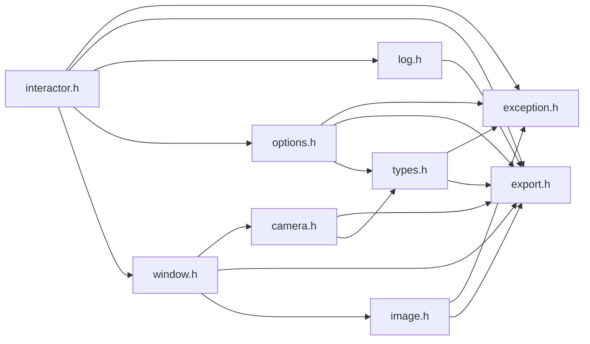
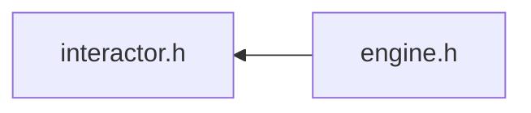

# File interactor.h

![][C++]

**Location**: `interactor.h`


## Classes

* [f3d::interaction\_bind\_t](structf3d_1_1interaction__bind__t.md)
* [f3d::interactor](classf3d_1_1interactor.md)
* [f3d::interactor::already\_exists\_exception](structf3d_1_1interactor_1_1already__exists__exception.md)
* [f3d::interactor::does\_not\_exists\_exception](structf3d_1_1interactor_1_1does__not__exists__exception.md)
* [f3d::interactor::command\_runtime\_exception](structf3d_1_1interactor_1_1command__runtime__exception.md)
* [f3d::interactor::invalid\_args\_exception](structf3d_1_1interactor_1_1invalid__args__exception.md)

## Namespaces

* [f3d](namespacef3d.md)

## Includes

* [exception.h](exception_8h.md)
* export.h
* [log.h](log_8h.md)
* [options.h](options_8h.md)
* [window.h](window_8h.md)





## Included by

* [engine.h](engine_8h.md)





## Source


```cpp
#ifndef f3d_interactor_h
#define f3d_interactor_h

#include "exception.h"
#include "export.h"
#include "log.h"
#include "options.h"
#include "window.h"

#include <functional>
#include <string>
#include <utility>
#include <vector>

namespace f3d
{

struct interaction_bind_t
{
  enum class ModifierKeys : unsigned char
  {
    ANY = 0x80,      // 10000000
    NONE = 0x0,      // 00000000
    CTRL = 0x1,      // 00000001
    SHIFT = 0x2,     // 00000010
    CTRL_SHIFT = 0x3 // 00000011
  };

  ModifierKeys mod = ModifierKeys::NONE;
  std::string inter;

  [[nodiscard]] bool operator<(const interaction_bind_t& bind) const;

  [[nodiscard]] bool operator==(const interaction_bind_t& bind) const;

  [[nodiscard]] std::string format() const;

  [[nodiscard]] static interaction_bind_t parse(std::string_view str);
};

class F3D_EXPORT interactor
{
public:
  using command_documentation_t = std::pair<std::string, std::string>;

  virtual interactor& initCommands() = 0;

  virtual interactor& addCommand(const std::string& action,
    std::function<void(const std::vector<std::string>&)> callback,
    std::optional<command_documentation_t> doc = std::nullopt,
    std::function<std::vector<std::string>(const std::vector<std::string>&)> completionCallback =
      nullptr) = 0;

  virtual interactor& removeCommand(const std::string& action) = 0;

  [[nodiscard]] virtual std::vector<std::string> getCommandActions() const = 0;

  virtual bool triggerCommand(std::string_view command, bool keepComments = true) = 0;

  using documentation_callback_t = std::function<std::pair<std::string, std::string>()>;

  enum class BindingType : std::uint8_t
  {
    CYCLIC = 0,
    NUMERICAL = 1,
    TOGGLE = 2,
    OTHER = 3,
  };

  virtual interactor& initBindings() = 0;

  virtual interactor& addBinding(const interaction_bind_t& bind, std::vector<std::string> commands,
    std::string group = {}, documentation_callback_t documentationCallback = nullptr,
    BindingType type = BindingType::OTHER) = 0;

  virtual interactor& addBinding(const interaction_bind_t& bind, std::string command,
    std::string group = {}, documentation_callback_t documentationCallback = nullptr,
    BindingType type = BindingType::OTHER) = 0;

  interactor& addBinding(const interaction_bind_t& bind, std::initializer_list<std::string> list,
    std::string group = {}, documentation_callback_t documentationCallback = nullptr,
    BindingType type = BindingType::OTHER)
  {
    return this->addBinding(bind, std::vector<std::string>(list), std::move(group),
      std::move(documentationCallback), type);
  }

  virtual interactor& removeBinding(const interaction_bind_t& bind) = 0;

  [[nodiscard]] virtual std::vector<std::string> getBindGroups() const = 0;

  [[nodiscard]] virtual std::vector<interaction_bind_t> getBindsForGroup(
    std::string group) const = 0;

  [[nodiscard]] virtual std::vector<interaction_bind_t> getBinds() const = 0;

  [[nodiscard]] virtual std::pair<std::string, std::string> getBindingDocumentation(
    const interaction_bind_t& bind) const = 0;

  [[nodiscard]] virtual BindingType getBindingType(const interaction_bind_t& bind) const = 0;


  virtual interactor& toggleAnimation() = 0;
  virtual interactor& startAnimation() = 0;
  virtual interactor& stopAnimation() = 0;
  [[nodiscard]] virtual bool isPlayingAnimation() = 0;


  virtual interactor& enableCameraMovement() = 0;
  virtual interactor& disableCameraMovement() = 0;


  enum class MouseButton : unsigned char
  {
    LEFT,
    RIGHT,
    MIDDLE
  };

  enum class WheelDirection : unsigned char
  {
    FORWARD,
    BACKWARD,
    LEFT,
    RIGHT
  };

  enum class InputAction : unsigned char
  {
    PRESS,
    RELEASE
  };

  enum class InputModifier : unsigned char
  {
    NONE,
    CTRL,
    SHIFT,
    CTRL_SHIFT
  };

  virtual interactor& triggerModUpdate(InputModifier mod) = 0;

  virtual interactor& triggerMouseButton(InputAction action, MouseButton button) = 0;

  virtual interactor& triggerMousePosition(double xpos, double ypos) = 0;

  virtual interactor& triggerMouseWheel(WheelDirection direction) = 0;

  virtual interactor& triggerKeyboardKey(InputAction action, std::string_view keySym) = 0;

  virtual interactor& triggerTextCharacter(unsigned int codepoint) = 0;

  virtual bool playInteraction(const std::filesystem::path& file, double deltaTime = 1.0 / 30,
    std::function<void()> userCallBack = nullptr) = 0;

  virtual bool recordInteraction(const std::filesystem::path& file) = 0;

  virtual interactor& start(
    double deltaTime = 1.0 / 30, std::function<void()> userCallBack = nullptr) = 0;

  virtual interactor& stop() = 0;

  virtual interactor& requestRender() = 0;

  struct already_exists_exception : public exception
  {
    explicit already_exists_exception(const std::string& what = "");
  };

  struct does_not_exists_exception : public exception
  {
    explicit does_not_exists_exception(const std::string& what = "");
  };

  struct command_runtime_exception : public exception
  {
    explicit command_runtime_exception(const std::string& what = "");
  };

  struct invalid_args_exception : public exception
  {
    explicit invalid_args_exception(const std::string& what = "")
      : exception(what)
    {
    }
  };

protected:
  interactor() = default;
  virtual ~interactor() = default;
  interactor(const interactor& opt) = delete;
  interactor(interactor&& opt) = delete;
  interactor& operator=(const interactor& opt) = delete;
  interactor& operator=(interactor&& opt) = delete;
};

//----------------------------------------------------------------------------
inline bool interaction_bind_t::operator<(const interaction_bind_t& bind) const
{
  return this->mod < bind.mod || (this->mod == bind.mod && this->inter < bind.inter);
}

//----------------------------------------------------------------------------
inline bool interaction_bind_t::operator==(const interaction_bind_t& bind) const
{
  return this->mod == bind.mod && this->inter == bind.inter;
}

//----------------------------------------------------------------------------
inline std::string interaction_bind_t::format() const
{
  switch (this->mod)
  {
    case ModifierKeys::CTRL_SHIFT:
      return "Ctrl+Shift+" + this->inter;
    case ModifierKeys::CTRL:
      return "Ctrl+" + this->inter;
    case ModifierKeys::SHIFT:
      return "Shift+" + this->inter;
    case ModifierKeys::ANY:
      return "Any+" + this->inter;
    default:
      // No need to check for NONE
      return this->inter;
  }
}

//----------------------------------------------------------------------------
inline interaction_bind_t interaction_bind_t::parse(std::string_view str)
{
  interaction_bind_t bind;
  auto plusIt = str.find_last_of('+');
  if (plusIt == std::string::npos)
  {
    bind.inter = str;
  }
  else
  {
    bind.inter = str.substr(plusIt + 1);

    std::string_view modStr = str.substr(0, plusIt);
    if (modStr == "Ctrl+Shift")
    {
      bind.mod = ModifierKeys::CTRL_SHIFT;
    }
    else if (modStr == "Shift")
    {
      bind.mod = ModifierKeys::SHIFT;
    }
    else if (modStr == "Ctrl")
    {
      bind.mod = ModifierKeys::CTRL;
    }
    else if (modStr == "Any")
    {
      bind.mod = ModifierKeys::ANY;
    }
    else if (modStr == "None")
    {
      bind.mod = ModifierKeys::NONE;
    }
    else
    {
      f3d::log::warn("Invalid modifier: ", modStr, ", ignoring modifier");
    }
  }
  return bind;
}
}

#endif
```


[public]: https://img.shields.io/badge/-public-brightgreen (public)
[C++]: https://img.shields.io/badge/language-C%2B%2B-blue (C++)
[protected]: https://img.shields.io/badge/-protected-yellow (protected)
[const]: https://img.shields.io/badge/-const-lightblue (const)
[static]: https://img.shields.io/badge/-static-lightgrey (static)
[private]: https://img.shields.io/badge/-private-red (private)