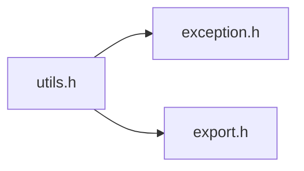

# File utils.h

![][C++]

**Location**: `utils.h`


## Classes

* [f3d::utils](classf3d_1_1utils.md)
* [f3d::utils::tokenize\_exception](structf3d_1_1utils_1_1tokenize__exception.md)
* [f3d::utils::glob\_exception](structf3d_1_1utils_1_1glob__exception.md)
* [f3d::utils::string\_template](classf3d_1_1utils_1_1string__template.md)
* [f3d::utils::string\_template::lookup\_error](structf3d_1_1utils_1_1string__template_1_1lookup__error.md)

## Namespaces

* [f3d](namespacef3d.md)

## Includes

* [exception.h](exception_8h.md)
* export.h





## Source


```cpp
#ifndef f3d_utils_h
#define f3d_utils_h

#include "exception.h"
#include "export.h"

#include <filesystem>
#include <map>
#include <optional>
#include <regex>
#include <sstream>
#include <string>
#include <vector>

namespace f3d
{
class F3D_EXPORT utils
{
public:
  [[nodiscard]] static unsigned int textDistance(std::string_view strA, std::string_view strB);

  // clang-format off
  [[nodiscard]] static std::vector<std::string> tokenize(std::string_view str, bool keepComments = true);
  // clang-format on

  [[nodiscard]] static std::filesystem::path collapsePath(
    const std::filesystem::path& path, const std::filesystem::path& baseDirectory = {});

  [[nodiscard]] static std::string globToRegex(std::string_view glob, char pathSeparator = '/');

  [[nodiscard]] static std::optional<std::string> getEnv(const std::string& env);

  enum class KnownFolder : unsigned char
  {
    ROAMINGAPPDATA, // %APPDATA% (%USERPROFILE%\AppData\Roaming)
    LOCALAPPDATA,   // %LOCALAPPDATA% (%USERPROFILE%\AppData\Local)
    PICTURES        // %USERPROFILE%\Pictures
  };

  [[nodiscard]] static std::optional<std::string> getKnownFolder(KnownFolder knownFolder);

  struct tokenize_exception : public exception
  {
    explicit tokenize_exception(const std::string& what = "");
  };

  struct glob_exception : public exception
  {
    explicit glob_exception(const std::string& what = "");
  };

  class string_template
  {
    std::vector<std::pair<std::string, bool>> fragments;

  public:
    explicit string_template(const std::string& templateString);

    template<typename F>
    string_template& substitute(F lookup);

    string_template& substitute(const std::map<std::string, std::string>& lookup);

    [[nodiscard]] std::string str() const;

    [[nodiscard]] std::vector<std::string> variables() const;

    struct lookup_error : public std::out_of_range
    {
      explicit lookup_error(const std::string& what = "")
        : std::out_of_range(what)
      {
      }
    };
  };
};

//------------------------------------------------------------------------------
inline utils::string_template::string_template(const std::string& templateString)
{
  const std::string varName = "[\\w_.%:-]+";
  const std::string escapedVar = "(\\{(\\{" + varName + "\\})\\})";
  const std::string substVar = "(\\{(" + varName + ")\\})";
  const std::regex escapedVarRe(escapedVar);
  const std::regex substVarRe(substVar);

  const auto callback = [&](const std::string& m)
  {
    if (std::regex_match(m, escapedVarRe))
    {
      this->fragments.emplace_back(std::regex_replace(m, escapedVarRe, "$2"), false);
    }
    else if (std::regex_match(m, substVarRe))
    {
      this->fragments.emplace_back(std::regex_replace(m, substVarRe, "$2"), true);
    }
    else
    {
      this->fragments.emplace_back(m, false);
    }
  };

  const std::regex re(escapedVar + "|" + substVar);
  std::sregex_token_iterator begin(templateString.begin(), templateString.end(), re, { -1, 0 });
  std::for_each(begin, std::sregex_token_iterator(), callback);
}

//------------------------------------------------------------------------------
template<typename F>
utils::string_template& utils::string_template::substitute(F lookup)
{
  for (auto& [fragment, isVariable] : this->fragments)
  {
    if (isVariable)
    {
      try
      {
        fragment = lookup(fragment);
        isVariable = false;
      }
      catch (const lookup_error&)
      {
        /* leave variable as is */
      }
    }
  }
  return *this;
}

//------------------------------------------------------------------------------
inline utils::string_template& utils::string_template::substitute(
  const std::map<std::string, std::string>& lookup)
{
  return this->substitute(
    [&](const std::string& key)
    {
      try
      {
        return lookup.at(key);
      }
      catch (const std::out_of_range&)
      {
        throw lookup_error(key);
      }
    });
}

//------------------------------------------------------------------------------
inline std::string utils::string_template::str() const
{
  std::ostringstream ss;
  // cppcheck-suppress unassignedVariable
  // (false positive, fixed in cppcheck 2.8)
  for (const auto& [fragment, isVariable] : this->fragments)
  {
    if (isVariable)
    {
      ss << "{" << fragment << "}";
    }
    else
    {
      ss << fragment;
    }
  }
  return ss.str();
}

//------------------------------------------------------------------------------
inline std::vector<std::string> utils::string_template::variables() const
{
  std::vector<std::string> variables;
  for (const auto& [fragment, isVariable] : this->fragments)
  {
    if (isVariable)
    {
      variables.emplace_back(fragment);
    }
  }
  return variables;
}
}

#endif
```


[public]: https://img.shields.io/badge/-public-brightgreen (public)
[C++]: https://img.shields.io/badge/language-C%2B%2B-blue (C++)
[const]: https://img.shields.io/badge/-const-lightblue (const)
[protected]: https://img.shields.io/badge/-protected-yellow (protected)
[static]: https://img.shields.io/badge/-static-lightgrey (static)
[private]: https://img.shields.io/badge/-private-red (private)