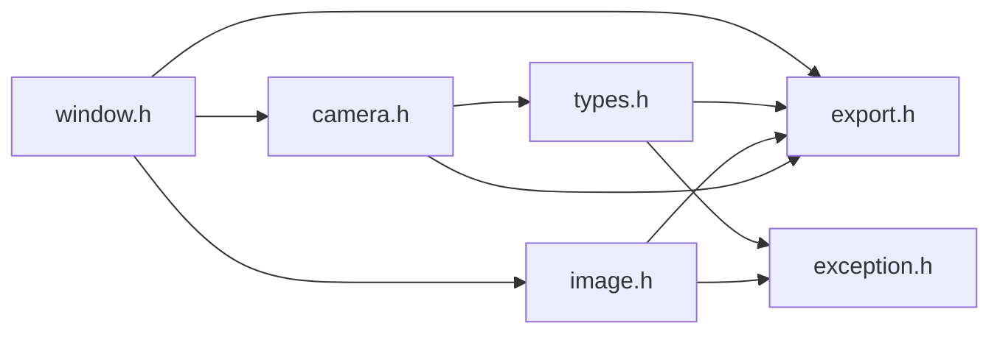

# File window.h

![][C++]

**Location**: `window.h`


## Classes

* [f3d::window](classf3d_1_1window.md)

## Namespaces

* [f3d](namespacef3d.md)

## Includes

* [camera.h](camera_8h.md)
* export.h
* [image.h](image_8h.md)





## Included by

* [engine.h](engine_8h.md)
* [interactor.h](interactor_8h.md)


## Source


```cpp
#ifndef f3d_window_h
#define f3d_window_h

#include "camera.h"
#include "export.h"
#include "image.h"

#include <string>

namespace f3d
{
class F3D_EXPORT window
{
public:
  enum class Type : unsigned char
  {
    NONE,
    EXTERNAL,
    GLX,
    WGL,
    COCOA,
    EGL,
    OSMESA,
    WASM,
    UNKNOWN
  };

  [[nodiscard]] virtual Type getType() = 0;

  [[nodiscard]] virtual bool isOffscreen() = 0;

  [[nodiscard]] virtual camera& getCamera() = 0;

  virtual bool render() = 0;

  [[nodiscard]] virtual image renderToImage(bool noBackground = false) = 0;

  virtual window& setSize(int width, int height) = 0;

  [[nodiscard]] virtual int getWidth() const = 0;

  [[nodiscard]] virtual int getHeight() const = 0;

  virtual window& setPosition(int x, int y) = 0;

  virtual window& setIcon(const unsigned char* icon, size_t iconSize) = 0;

  virtual window& setWindowName(std::string_view windowName) = 0;

  [[nodiscard]] virtual point3_t getWorldFromDisplay(const point3_t& displayPoint) const = 0;

  [[nodiscard]] virtual point3_t getDisplayFromWorld(const point3_t& worldPoint) const = 0;

protected:
  window() = default;
  virtual ~window() = default;
  window(const window&) = delete;
  window(window&&) = delete;
  window& operator=(const window&) = delete;
  window& operator=(window&&) = delete;
};
}

#endif
```


[public]: https://img.shields.io/badge/-public-brightgreen (public)
[C++]: https://img.shields.io/badge/language-C%2B%2B-blue (C++)
[protected]: https://img.shields.io/badge/-protected-yellow (protected)
[const]: https://img.shields.io/badge/-const-lightblue (const)
[static]: https://img.shields.io/badge/-static-lightgrey (static)
[private]: https://img.shields.io/badge/-private-red (private)