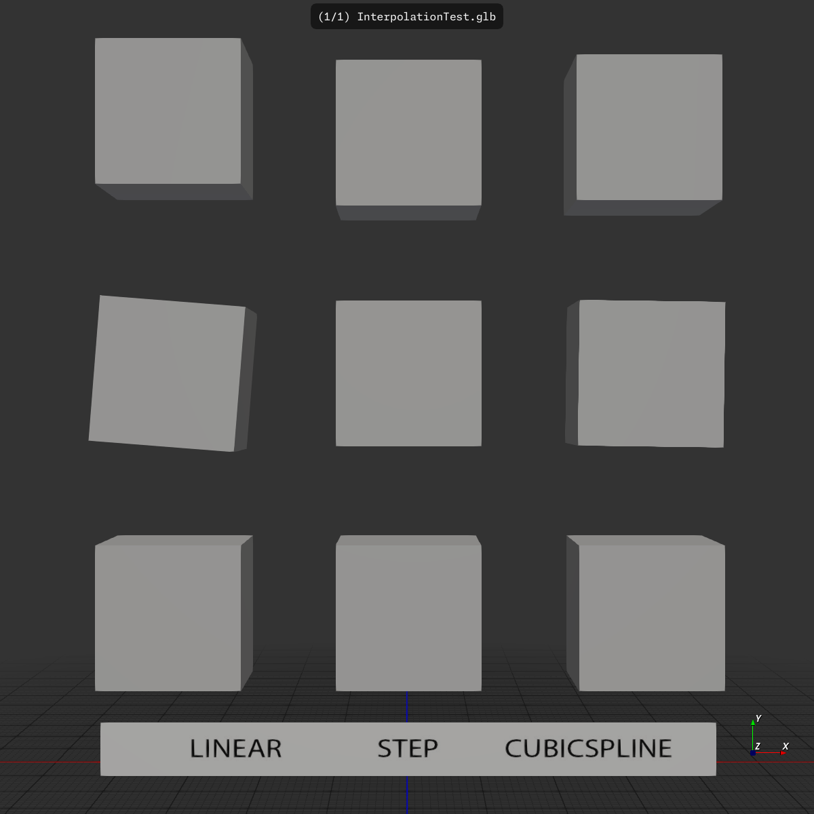
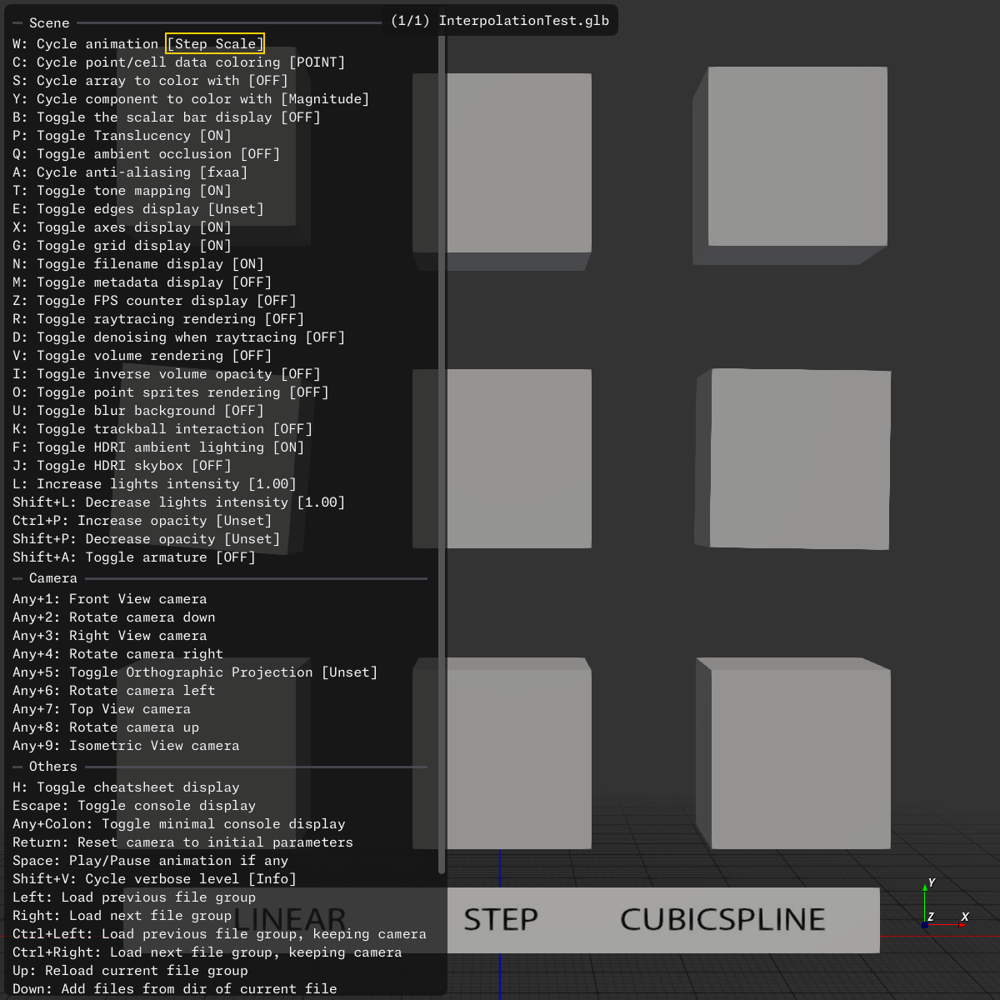
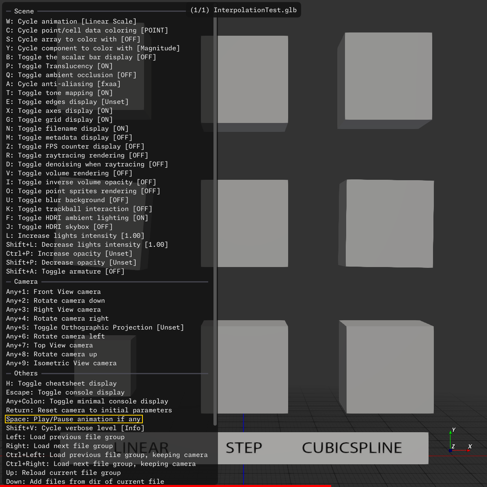
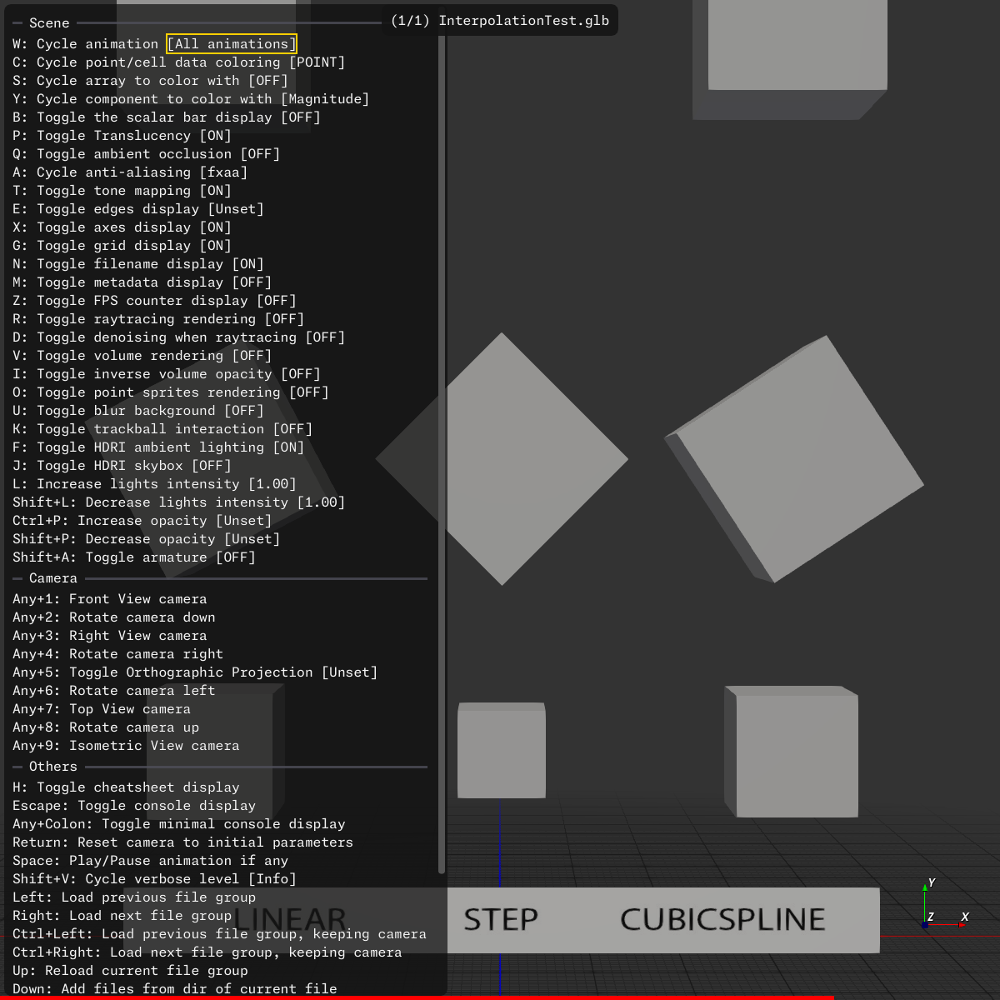

# Animations

F3D is able to play animations for any files which contain them.
Play them either interactively or by selecting a specific time to display.
For files containing multiple animations, F3D allows the user to either play each animation separately or to select multiple animations to play at the same.

## Demonstration

This specific example uses an animation file which can be downloaded [here](https://github.com/f3d-app/f3d/blob/606089959c9520085a9cbf70660fb0ffc68fb934/testing/data/InterpolationTest.glb).

Load the example animation file shown above by executing within command line: `f3d InterpolationTest.glb`

To view current animation name, press <kbd>H</kbd> to open up cheatsheet menu

Press <kbd>W</kbd> to cycle through available animations

Press <kbd>space</kbd> to play/pause current animation.
Note: A red bar runs along the bottom of screen to indicate the current time interval of the animation sequence if animation-progress was turned on.

"All Animations" will play all animations at the same time if supported by the file format.

## Command line options

F3D animation behavior can be fully controlled from the command line using the following options.

| Options                      | Default             | Description                                     |
| ---------------------------- | ------------------- | ----------------------------------------------- |
| \-\-animation\-indices       |                     | Select the animations to play.                  |
| \-\-animation\-indices=-1    |                     | Play all animations at once (only if supported) |
| \-\-animation\-speed\-factor | Time Unit = Seconds | Adjust time unit.                               |
| \-\-animation\-frame\-rate   | 60 FPS              | Adjust animation frame rate.                    |
| \-\-animation\-time          |                     | Load a specific time value on start.            |

## Animation Interactions

- Press <kbd>W</kbd> to cycle through animations
- Press <kbd>Space</kbd> to play/pause animation

## Cycling Animations

Pressing <kbd>W</kbd> let you cycle the animation to show.

When cycling, F3D will cycle like this:

- Multiple animations or all animations
- Animation index 0
- Animation index 1
- ...
- Animation index N
- All animations (if multiple animations supported and more than one animation is available)
- No animations

Please note that if you selected multiple animation indices, you will never cycle back to it.
All animations will only be cycled if supported by the currently loaded files.

## Time Units

When F3D plays an animation, it assumes the time unit is in seconds to show accurate speed of animation.

## Coloring range

When coloring while loading a time value or playing the animation, the coloring range will be automatically expanded from previously loaded time value,
this include `--animation-time` that first load the initial time before loading the provided time value.

## Animation Support Level

The animation support level is listed for each reader [here](SUPPORTED_FORMATS.md).

- NONE: Animation is not supported, either by the file format or the implementation
- UNIQUE: There will never be more then one animation
- SINGLE: There can be multiple animations but only one can be selected at a time
- MULTI: Multiple animations can be selected at a time

When opening multiple files at the same time using the `--multi-file-mode` option and selecting multiple animations to show,
F3D may warn when combining SINGLE and non SINGLE files, but will still try to respect the chosen animation indices.
