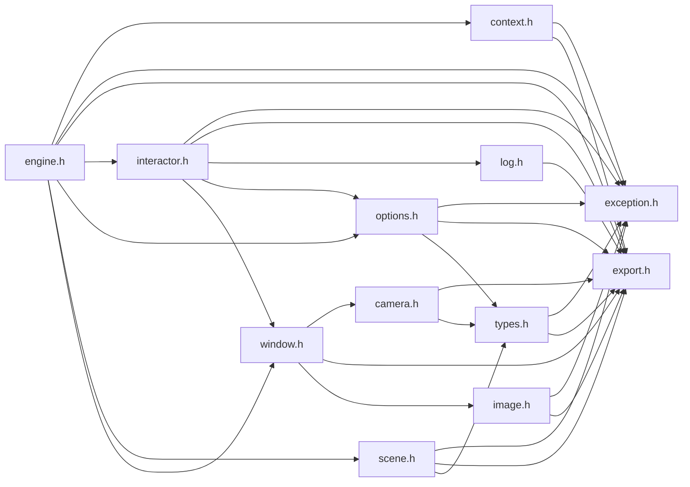

# File engine.h

![][C++]

**Location**: `engine.h`


## Classes

* [f3d::engine](classf3d_1_1engine.md)
* [f3d::engine::libInformation](structf3d_1_1engine_1_1libInformation.md)
* [f3d::engine::readerInformation](structf3d_1_1engine_1_1readerInformation.md)
* [f3d::engine::no\_window\_exception](structf3d_1_1engine_1_1no__window__exception.md)
* [f3d::engine::no\_interactor\_exception](structf3d_1_1engine_1_1no__interactor__exception.md)
* [f3d::engine::plugin\_exception](structf3d_1_1engine_1_1plugin__exception.md)
* [f3d::engine::cache\_exception](structf3d_1_1engine_1_1cache__exception.md)

## Namespaces

* [f3d](namespacef3d.md)

## Includes

* [context.h](context_8h.md)
* [exception.h](exception_8h.md)
* export.h
* [interactor.h](interactor_8h.md)
* [options.h](options_8h.md)
* [scene.h](scene_8h.md)
* [window.h](window_8h.md)





## Source


```cpp
#ifndef f3d_engine_h
#define f3d_engine_h

#include "context.h"
#include "exception.h"
#include "export.h"
#include "interactor.h"
#include "options.h"
#include "scene.h"
#include "window.h"

#include <map>
#include <string>
#include <vector>

namespace f3d
{
class F3D_EXPORT engine
{
public:
  [[nodiscard]] static engine create(bool offscreen = false);

  [[nodiscard]] static engine createNone();

  [[nodiscard]] static engine createGLX(bool offscreen = false);

  [[nodiscard]] static engine createWGL(bool offscreen = false);

  [[nodiscard]] static engine createEGL();

  [[nodiscard]] static engine createOSMesa();

  [[nodiscard]] static engine createExternal(const context::function& getProcAddress);

  [[nodiscard]] static engine createExternalGLX();

  [[nodiscard]] static engine createExternalWGL();

  [[nodiscard]] static engine createExternalCOCOA();

  [[nodiscard]] static engine createExternalEGL();

  [[nodiscard]] static engine createExternalOSMesa();

  ~engine();


  engine(const engine& other) = delete;
  engine(engine&& other) noexcept;
  engine& operator=(const engine& other) = delete;
  engine& operator=(engine&& other) noexcept;

  engine& setCachePath(const std::filesystem::path& cachePath);

  engine& setOptions(const options& opt);

  engine& setOptions(options&& opt);

  [[nodiscard]] options& getOptions();

  [[nodiscard]] window& getWindow();

  [[nodiscard]] scene& getScene();

  [[nodiscard]] interactor& getInteractor();

  static std::map<std::string, bool> getRenderingBackendList();

  static void loadPlugin(const std::string& pathOrName,
    const std::vector<std::filesystem::path>& pluginSearchPaths = {});

  static void autoloadPlugins();

  [[nodiscard]] static std::vector<std::string> getPluginsList(
    const std::filesystem::path& pluginPath);

  [[nodiscard]] static std::vector<std::string> getAllReaderOptionNames();

  static void setReaderOption(const std::string& name, const std::string& value);

  struct libInformation
  {
    std::string Version;
    std::string VersionFull;
    std::string BuildDate;
    std::string BuildSystem;
    std::string Compiler;
    std::map<std::string, bool> Modules;
    std::string VTKVersion;
    std::vector<std::string> Copyrights;
    std::string License;
  };

  [[nodiscard]] static libInformation getLibInfo();

  struct readerInformation
  {
    std::string Name;
    std::string Description;
    std::vector<std::string> Extensions;
    std::vector<std::string> MimeTypes;
    std::string PluginName;
    bool HasSceneReader;
    bool HasGeometryReader;
  };

  [[nodiscard]] static std::vector<readerInformation> getReadersInfo();

  struct no_window_exception : public exception
  {
    explicit no_window_exception(const std::string& what = "");
  };

  struct no_interactor_exception : public exception
  {
    explicit no_interactor_exception(const std::string& what = "");
  };

  struct plugin_exception : public exception
  {
    explicit plugin_exception(const std::string& what = "");
  };

  struct cache_exception : public exception
  {
    explicit cache_exception(const std::string& what = "");
  };

private:
  class internals;
  internals* Internals;

  engine(
    const std::optional<window::Type>& windowType, bool offscreen, const context::function& loader);
};
}

#endif
```


[public]: https://img.shields.io/badge/-public-brightgreen (public)
[C++]: https://img.shields.io/badge/language-C%2B%2B-blue (C++)
[const]: https://img.shields.io/badge/-const-lightblue (const)
[protected]: https://img.shields.io/badge/-protected-yellow (protected)
[static]: https://img.shields.io/badge/-static-lightgrey (static)
[private]: https://img.shields.io/badge/-private-red (private)