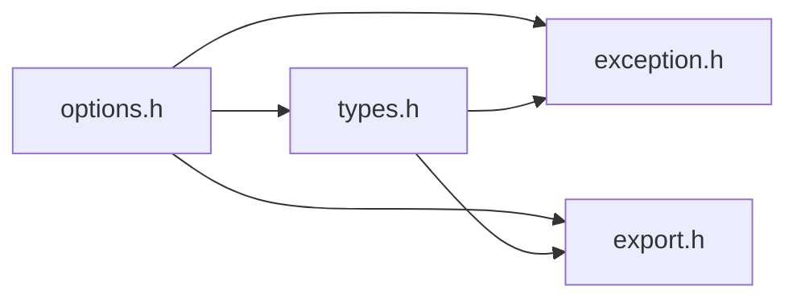

# File options.h {#options_8h}

![][C++]

**Location**: `options.h`


## Classes

* [f3d::options](classf3d_1_1options.md)
* [f3d::options::parsing\_exception](structf3d_1_1options_1_1parsing__exception.md)
* [f3d::options::incompatible\_exception](structf3d_1_1options_1_1incompatible__exception.md)
* [f3d::options::inexistent\_exception](structf3d_1_1options_1_1inexistent__exception.md)
* [f3d::options::no\_value\_exception](structf3d_1_1options_1_1no__value__exception.md)
* [f3d::options::interactor](structf3d_1_1options_1_1interactor.md)
* [f3d::options::model](structf3d_1_1options_1_1model.md)
* [f3d::options::model::color](structf3d_1_1options_1_1model_1_1color.md)
* [f3d::options::model::emissive](structf3d_1_1options_1_1model_1_1emissive.md)
* [f3d::options::model::matcap](structf3d_1_1options_1_1model_1_1matcap.md)
* [f3d::options::model::material](structf3d_1_1options_1_1model_1_1material.md)
* [f3d::options::model::normal](structf3d_1_1options_1_1model_1_1normal.md)
* [f3d::options::model::point\_sprites](structf3d_1_1options_1_1model_1_1point__sprites.md)
* [f3d::options::model::scivis](structf3d_1_1options_1_1model_1_1scivis.md)
* [f3d::options::model::volume](structf3d_1_1options_1_1model_1_1volume.md)
* [f3d::options::render](structf3d_1_1options_1_1render.md)
* [f3d::options::render::armature](structf3d_1_1options_1_1render_1_1armature.md)
* [f3d::options::render::axes\_grid](structf3d_1_1options_1_1render_1_1axes__grid.md)
* [f3d::options::render::background](structf3d_1_1options_1_1render_1_1background.md)
* [f3d::options::render::background::blur](structf3d_1_1options_1_1render_1_1background_1_1blur.md)
* [f3d::options::render::effect](structf3d_1_1options_1_1render_1_1effect.md)
* [f3d::options::render::effect::antialiasing](structf3d_1_1options_1_1render_1_1effect_1_1antialiasing.md)
* [f3d::options::render::effect::blending](structf3d_1_1options_1_1render_1_1effect_1_1blending.md)
* [f3d::options::render::grid](structf3d_1_1options_1_1render_1_1grid.md)
* [f3d::options::render::hdri](structf3d_1_1options_1_1render_1_1hdri.md)
* [f3d::options::render::light](structf3d_1_1options_1_1render_1_1light.md)
* [f3d::options::render::raytracing](structf3d_1_1options_1_1render_1_1raytracing.md)
* [f3d::options::scene](structf3d_1_1options_1_1scene.md)
* [f3d::options::scene::animation](structf3d_1_1options_1_1scene_1_1animation.md)
* [f3d::options::scene::camera](structf3d_1_1options_1_1scene_1_1camera.md)
* [f3d::options::ui](structf3d_1_1options_1_1ui.md)
* [f3d::options::ui::backdrop](structf3d_1_1options_1_1ui_1_1backdrop.md)
* [f3d::options::ui::drop\_zone](structf3d_1_1options_1_1ui_1_1drop__zone.md)

## Namespaces

* [f3d](namespacef3d.md)

## Includes

* [exception.h](exception_8h.md)
* export.h
* [types.h](types_8h.md)





## Included by

* [engine.h](engine_8h.md)
* [interactor.h](interactor_8h.md)


## Functions

### Function operator\<\< {#options_8h_1ae45474fc5074fe195869b53d2a5429c1}

![][public]


```cpp
std::ostream & operator<<(std::ostream &os, const f3d::color_t &color)
```


**Parameters**:

* std::ostream & **os**
* const [f3d::color\_t](classf3d_1_1color__t.md) & **color**

**Return type**: std::ostream &

### Function operator\<\< {#options_8h_1a787081c010d4258cf01a9d7e4c0fdc1a}

![][public]


```cpp
std::ostream & operator<<(std::ostream &os, const f3d::direction_t &direction)
```


**Parameters**:

* std::ostream & **os**
* const [f3d::direction\_t](classf3d_1_1direction__t.md) & **direction**

**Return type**: std::ostream &

### Function operator\<\< {#options_8h_1a9ac8e9c6c6a4dab9c5d3479c457f136d}

![][public]


```cpp
std::ostream & operator<<(std::ostream &os, const f3d::colormap_t &cm)
```


**Parameters**:

* std::ostream & **os**
* const [f3d::colormap\_t](classf3d_1_1colormap__t.md) & **cm**

**Return type**: std::ostream &

### Function operator\<\< {#options_8h_1a690455850de66a7a03be6b3208cb16a4}

![][public]


```cpp
std::ostream & operator<<(std::ostream &os, const f3d::transform2d_t &transform)
```


**Parameters**:

* std::ostream & **os**
* const [f3d::transform2d\_t](classf3d_1_1transform2d__t.md) & **transform**

**Return type**: std::ostream &

## Source


```cpp
#ifndef f3d_options_h
#define f3d_options_h

#include "exception.h"
#include "export.h"
#include "types.h"

#include <array>
#include <filesystem>
#include <optional>
#include <string>
#include <variant>
#include <vector>

namespace f3d
{
// Declared here for simplicity
using option_variant_t =
  std::variant<bool, int, double, std::string, std::vector<double>, std::vector<int>>;

class F3D_EXPORT options
{
public:

  options();
  ~options();
  options(const options& opt);
  options& operator=(const options& opt);
  options(options&& other) noexcept;
  options& operator=(options&& other) noexcept;

  options& set(std::string_view name, const option_variant_t& value);

  [[nodiscard]] option_variant_t get(std::string_view name) const;

  options& setAsString(std::string_view name, const std::string& str);

  [[nodiscard]] std::string getAsString(std::string_view name) const;

  options& toggle(std::string_view name);

  [[nodiscard]] bool isSame(const options& other, std::string_view name) const;

  [[nodiscard]] bool hasValue(std::string_view name) const;

  options& copy(const options& other, std::string_view name);

  [[nodiscard]] static std::vector<std::string> getAllNames();

  [[nodiscard]] std::vector<std::string> getNames() const;

  [[nodiscard]] std::pair<std::string, unsigned int> getClosestOption(
    std::string_view option) const;

  [[nodiscard]] bool isOptional(std::string_view option) const;

  options& reset(std::string_view name);

  options& removeValue(std::string_view name);

  template<typename T>
  [[nodiscard]] static T parse(const std::string& str);

  template<typename T>
  [[nodiscard]] static std::string format(const T& var);

  struct parsing_exception : public exception
  {
    explicit parsing_exception(const std::string& what = "");
  };

  struct incompatible_exception : public exception
  {
    explicit incompatible_exception(const std::string& what = "");
  };

  struct inexistent_exception : public exception
  {
    explicit inexistent_exception(const std::string& what = "");
  };

  struct no_value_exception : public exception
  {
    explicit no_value_exception(const std::string& what = "");
  };

  // clang-format off
    struct interactor {
    bool invert_zoom = false;
    bool trackball = false;
  } interactor;

  struct model {
    struct color {
      std::optional<double> opacity;
      std::optional<f3d::color_t> rgb;
      std::optional<std::filesystem::path> texture;
    } color;

    struct emissive {
      std::optional<f3d::color_t> factor;
      std::optional<std::filesystem::path> texture;
    } emissive;

    struct matcap {
      std::optional<std::filesystem::path> texture;
    } matcap;

    struct material {
      std::optional<double> base_ior;
      std::optional<double> metallic;
      std::optional<double> roughness;
      std::optional<std::filesystem::path> texture;
    } material;

    struct normal {
      std::optional<double> scale;
      std::optional<std::filesystem::path> texture;
    } normal;

    struct point_sprites {
      bool absolute_size = false;
      bool enable = false;
      double size = 10.0;
      std::string type = "sphere";
    } point_sprites;

    struct scivis {
      std::optional<std::string> array_name;
      bool cells = false;
      f3d::colormap_t colormap = f3d::colormap_t{0.0, 0.0, 0.0, 0.0, 0.4, 0.9, 0.0, 0.0, 0.8, 0.9, 0.9, 0.0, 1.0, 1.0, 1.0, 1.0};
      int component = -1;
      std::optional<int> discretization;
      bool enable = false;
      std::optional<std::vector<double>> range;
    } scivis;

    std::optional<f3d::transform2d_t> textures_transform;
    struct volume {
      bool enable = false;
      bool inverse = false;
    } volume;

  } model;

  struct render {
    struct armature {
      bool enable = false;
    } armature;

    struct axes_grid {
      bool enable = false;
    } axes_grid;

    std::optional<std::string> backface_type;
    struct background {
      struct blur {
        double coc = 20.0;
        bool enable = false;
      } blur;

      f3d::color_t color = f3d::color_t{0.2, 0.2, 0.2};
      bool skybox = false;
    } background;

    struct effect {
      bool ambient_occlusion = false;
      [[deprecated("use render.effect.antialiasing.enable instead")]] bool anti_aliasing = false;
      struct antialiasing {
        bool enable = false;
        std::string mode = "fxaa";
      } antialiasing;

      struct blending {
        bool enable = false;
        std::string mode = "ddp";
      } blending;

      std::optional<std::string> final_shader;
      bool tone_mapping = false;
      [[deprecated("use render.effect.blending.enable instead")]] bool translucency_support = false;
    } effect;

    struct grid {
      bool absolute = false;
      f3d::color_t color = f3d::color_t{0.0, 0.0, 0.0};
      bool enable = false;
      int subdivisions = 10;
      std::optional<double> unit;
    } grid;

    struct hdri {
      bool ambient = false;
      std::optional<std::filesystem::path> file;
    } hdri;

    struct light {
      double intensity = 1.0;
    } light;

    std::optional<double> line_width;
    std::optional<double> point_size;
    struct raytracing {
      bool denoise = false;
      bool enable = false;
      int samples = 5;
    } raytracing;

    std::optional<bool> show_edges;
  } render;

  struct scene {
    struct animation {
      bool autoplay = false;
      [[deprecated("use scene.animation.indices instead")]] int index = 0;
      std::vector<int> indices = {0};
      f3d::ratio_t speed_factor = f3d::ratio_t{1.0};
    } animation;

    struct camera {
      std::optional<int> index;
      std::optional<bool> orthographic;
    } camera;

    std::optional<std::string> force_reader;
    f3d::direction_t up_direction = f3d::direction_t{0,1,0};
  } scene;

  struct ui {
    bool animation_progress = false;
    std::optional<f3d::color_t> animation_progress_color;
    bool axis = false;
    struct backdrop {
      double opacity = 0.9;
    } backdrop;

    bool cheatsheet = false;
    bool console = false;
    struct drop_zone {
      std::string custom_binds = "";
      bool enable = false;
      [[deprecated("use ui.drop_zone.custom_binds instead")]] std::string info = "";
      bool show_logo = false;
    } drop_zone;

    [[deprecated("use ui.drop_zone.enable instead")]] bool dropzone = false;
    [[deprecated("use ui.drop_zone.custom_binds instead")]] std::string dropzone_info = "";
    bool filename = false;
    std::string filename_info = "";
    std::optional<std::filesystem::path> font_file;
    bool fps = false;
    bool hdri_filename = false;
    bool loader_progress = false;
    std::optional<f3d::color_t> loader_progress_color;
    bool metadata = false;
    bool minimal_console = false;
    bool scalar_bar = false;
    f3d::ratio_t scale = f3d::ratio_t{1.0};
    f3d::color_t x_color = f3d::color_t{0.9764705882352941,0.2627450980392157,0.023529411764705882};
    f3d::color_t y_color = f3d::color_t{0.47843137254901963,1.0,0.47843137254901963};
    f3d::color_t z_color = f3d::color_t{0.47058823529411764,0.5450980392156862,1.0};
  } ui;


  // clang-format on
};

}

// Certain options types are not trivially streamable
//----------------------------------------------------------------------------
inline std::ostream& operator<<(std::ostream& os, const f3d::color_t& color)
{
  os << f3d::options::format(color);
  return os;
}
inline std::ostream& operator<<(std::ostream& os, const f3d::direction_t& direction)
{
  os << f3d::options::format(direction);
  return os;
}
inline std::ostream& operator<<(std::ostream& os, const f3d::colormap_t& cm)
{
  os << f3d::options::format(cm);
  return os;
}
inline std::ostream& operator<<(std::ostream& os, const f3d::transform2d_t& transform)
{
  os << f3d::options::format(transform);
  return os;
}
#endif
```


[public]: https://img.shields.io/badge/-public-brightgreen (public)
[C++]: https://img.shields.io/badge/language-C%2B%2B-blue (C++)
[const]: https://img.shields.io/badge/-const-lightblue (const)
[protected]: https://img.shields.io/badge/-protected-yellow (protected)
[static]: https://img.shields.io/badge/-static-lightgrey (static)
[private]: https://img.shields.io/badge/-private-red (private)