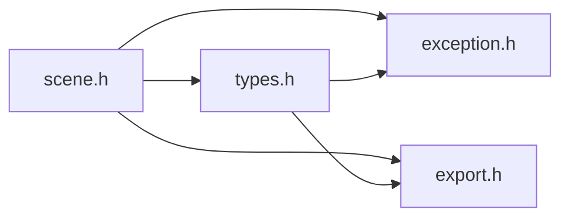

# File scene.h {#scene_8h}

![][C++]

**Location**: `scene.h`


## Classes

* [f3d::scene](classf3d_1_1scene.md)
* [f3d::scene::load\_failure\_exception](structf3d_1_1scene_1_1load__failure__exception.md)
* [f3d::scene::light\_exception](structf3d_1_1scene_1_1light__exception.md)

## Namespaces

* [f3d](namespacef3d.md)

## Includes

* [exception.h](exception_8h.md)
* export.h
* [types.h](types_8h.md)





## Included by

* [engine.h](engine_8h.md)


## Source


```cpp
#ifndef f3d_scene_h
#define f3d_scene_h

#include "exception.h"
#include "export.h"
#include "types.h"

#include <filesystem>
#include <string>
#include <vector>

namespace f3d
{
class F3D_EXPORT scene
{
public:
  struct load_failure_exception : public exception
  {
    explicit load_failure_exception(const std::string& what = "")
      : exception(what) {};
  };


  virtual scene& add(const std::filesystem::path& filePath) = 0;
  virtual scene& add(const std::vector<std::filesystem::path>& filePath) = 0;
  virtual scene& add(const std::vector<std::string>& filePathStrings) = 0;

  virtual scene& add(const mesh_t& mesh) = 0;


  scene& add(std::initializer_list<std::string> list)
  {
    return this->add(std::vector<std::string>(list));
  }
  scene& add(std::initializer_list<std::filesystem::path> list)
  {
    return this->add(std::vector<std::filesystem::path>(list));
  }

  virtual scene& clear() = 0;

  struct light_exception : public exception
  {
    explicit light_exception(const std::string& what = "")
      : f3d::exception(what) {};
  };

  virtual int addLight(const light_state_t& lightState) const = 0;

  [[nodiscard]] virtual int getLightCount() const = 0;

  [[nodiscard]] virtual light_state_t getLight(int index) const = 0;

  virtual scene& updateLight(int index, const light_state_t& lightState) = 0;

  virtual scene& removeLight(int index) = 0;

  virtual scene& removeAllLights() = 0;

  [[nodiscard]] virtual bool supports(const std::filesystem::path& filePath) = 0;

  virtual scene& loadAnimationTime(double timeValue) = 0;

  [[nodiscard]] virtual std::pair<double, double> animationTimeRange() = 0;

  [[nodiscard]] virtual unsigned int availableAnimations() const = 0;

protected:
  scene() = default;
  virtual ~scene() = default;
  scene(const scene& opt) = delete;
  scene(scene&& opt) = delete;
  scene& operator=(const scene& opt) = delete;
  scene& operator=(scene&& opt) = delete;
};
}

#endif
```


[public]: https://img.shields.io/badge/-public-brightgreen (public)
[C++]: https://img.shields.io/badge/language-C%2B%2B-blue (C++)
[const]: https://img.shields.io/badge/-const-lightblue (const)
[protected]: https://img.shields.io/badge/-protected-yellow (protected)
[static]: https://img.shields.io/badge/-static-lightgrey (static)
[private]: https://img.shields.io/badge/-private-red (private)