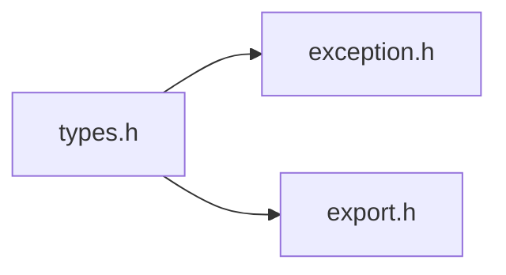
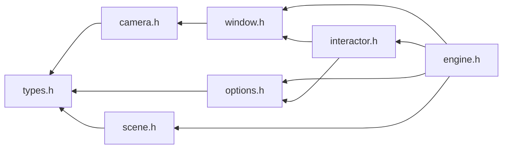

# File types.h {#types_8h}

![][C++]

**Location**: `types.h`


## Classes

* [f3d::type\_construction\_exception](structf3d_1_1type__construction__exception.md)
* [f3d::type\_access\_exception](structf3d_1_1type__access__exception.md)
* [f3d::point3\_t](structf3d_1_1point3__t.md)
* [f3d::vector3\_t](structf3d_1_1vector3__t.md)
* [f3d::ratio\_t](classf3d_1_1ratio__t.md)
* [f3d::double\_array\_t](classf3d_1_1double__array__t.md)
* [f3d::color\_t](classf3d_1_1color__t.md)
* [f3d::direction\_t](classf3d_1_1direction__t.md)
* [f3d::transform2d\_t](classf3d_1_1transform2d__t.md)
* [f3d::colormap\_t](classf3d_1_1colormap__t.md)
* [f3d::mesh\_t](structf3d_1_1mesh__t.md)
* [f3d::light\_state\_t](structf3d_1_1light__state__t.md)

## Namespaces

* [f3d](namespacef3d.md)

## Includes

* [exception.h](exception_8h.md)
* export.h





## Included by

* [camera.h](camera_8h.md)
* [options.h](options_8h.md)
* [scene.h](scene_8h.md)





## Source


```cpp
#ifndef f3d_types_h
#define f3d_types_h

#include "exception.h"
#include "export.h"

#include <algorithm>
#include <array>
#include <cstdint>
#include <iostream>
#include <string>
#include <vector>

namespace f3d
{
struct type_construction_exception : public exception
{
  explicit type_construction_exception(const std::string& what = "")
    : exception(what) {};
};

struct type_access_exception : public exception
{
  explicit type_access_exception(const std::string& what = "")
    : exception(what) {};
};

struct F3D_EXPORT point3_t : std::array<double, 3>
{
};

struct F3D_EXPORT vector3_t : std::array<double, 3>
{
};

using angle_deg_t = double;

class ratio_t
{
public:
  inline ratio_t() = default;
  inline explicit ratio_t(double val)
    : Value(val)
  {
  }
  inline operator double() const
  {
    return this->Value;
  }

private:
  double Value = 0;
};

template<unsigned int N>
class double_array_t
{
public:
  double_array_t() = default;
  explicit double_array_t(const std::vector<double>& vec)
  {
    if (vec.size() != N)
    {
      throw f3d::type_construction_exception("Provided vector does not have the right size");
    }
    std::copy_n(vec.begin(), N, this->Array.begin());
  }
  double_array_t(const std::initializer_list<double>& list)
  {
    if (list.size() != N)
    {
      throw f3d::type_construction_exception("Provided list does not have the right size");
    }
    std::copy_n(list.begin(), N, this->Array.begin());
  }
  [[nodiscard]] operator std::vector<double>() const
  {
    return std::vector<double>(this->Array.begin(), this->Array.end());
  }
  [[nodiscard]] bool operator==(const double_array_t& other) const
  {
    return this->Array == other.Array;
  }
  [[nodiscard]] bool operator!=(const double_array_t& other) const
  {
    return this->Array != other.Array;
  }
  [[nodiscard]] double operator[](size_t i) const
  {
    if (i >= N)
    {
      throw f3d::type_access_exception("Incorrect index");
    }
    return this->Array[i];
  }
  [[nodiscard]] double& operator[](size_t i)
  {
    if (i >= N)
    {
      throw f3d::type_access_exception("Incorrect index");
    }
    return this->Array[i];
  }
  [[nodiscard]] const double* data() const
  {
    return this->Array.data();
  }

protected:
  std::array<double, N> Array{ 0 };
};

class F3D_EXPORT color_t : public double_array_t<3>
{
public:
  inline color_t() = default;
  inline explicit color_t(const std::vector<double>& vec)
    : double_array_t(vec)
  {
  }
  inline color_t(const std::initializer_list<double>& list)
    : double_array_t(list)
  {
  }
  inline color_t(double red, double green, double blue)
  {
    (*this)[0] = red;
    (*this)[1] = green;
    (*this)[2] = blue;
  }
  [[nodiscard]] inline double r() const
  {
    return (*this)[0];
  }
  [[nodiscard]] inline double g() const
  {
    return (*this)[1];
  }
  [[nodiscard]] inline double b() const
  {
    return (*this)[2];
  }
};

class direction_t : public double_array_t<3>
{
public:
  inline direction_t() = default;
  inline explicit direction_t(const std::vector<double>& vec)
    : double_array_t(vec)
  {
  }
  inline direction_t(const std::initializer_list<double>& list)
    : double_array_t(list)
  {
  }
  inline direction_t(double x, double y, double z)
  {
    (*this)[0] = x;
    (*this)[1] = y;
    (*this)[2] = z;
  }
  [[nodiscard]] inline double x() const
  {
    return (*this)[0];
  }
  [[nodiscard]] inline double y() const
  {
    return (*this)[1];
  }
  [[nodiscard]] inline double z() const
  {
    return (*this)[2];
  }
  [[nodiscard]] operator f3d::vector3_t() const
  {
    return f3d::vector3_t{ this->Array };
  }
};


class transform2d_t : public double_array_t<9>
{
public:
  inline transform2d_t() = default;
  inline explicit transform2d_t(const std::vector<double>& vec)
    : double_array_t(vec)
  {
  }
  inline transform2d_t(const std::initializer_list<double>& list)
    : double_array_t(list)
  {
  }

  // clang-format off
  // clang-format on
  inline transform2d_t(double M1_1, double M1_2, double M1_3, double M2_1, double M2_2, double M2_3,
    double M3_1, double M3_2, double M3_3)
  {
    (*this)[0] = M1_1;
    (*this)[1] = M1_2;
    (*this)[2] = M1_3;
    (*this)[3] = M2_1;
    (*this)[4] = M2_2;
    (*this)[5] = M2_3;
    (*this)[6] = M3_1;
    (*this)[7] = M3_2;
    (*this)[8] = M3_3;
  }

  // clang-format off
  // clang-format on

  F3D_EXPORT transform2d_t(const double_array_t<2>& scale, const double_array_t<2>& translate,
    const angle_deg_t& angleRad);
};

class colormap_t
{
public:
  colormap_t() = default;
  explicit colormap_t(const std::vector<double>& vec)
    : Vector(vec)
  {
  }
  colormap_t(const std::initializer_list<double>& list)
    : Vector(list)
  {
  }
  [[nodiscard]] operator std::vector<double>() const
  {
    return this->Vector;
  }
  [[nodiscard]] bool operator==(const colormap_t& other) const
  {
    return this->Vector == other.Vector;
  }
  [[nodiscard]] bool operator!=(const colormap_t& other) const
  {
    return this->Vector != other.Vector;
  }
  [[nodiscard]] const double* data() const
  {
    return this->Vector.data();
  }

protected:
  std::vector<double> Vector;
};

struct mesh_t
{
  std::vector<float> points;
  std::vector<float> normals;
  std::vector<float> texture_coordinates;
  std::vector<unsigned int> face_sides;
  std::vector<unsigned int> face_indices;

  F3D_EXPORT std::pair<bool, std::string> isValid() const;
};

enum class F3D_EXPORT light_type : std::uint8_t
{
  HEADLIGHT = 1,
  CAMERA_LIGHT = 2,
  SCENE_LIGHT = 3,
};

struct F3D_EXPORT light_state_t
{
  light_type type = light_type::SCENE_LIGHT;
  point3_t position = { 0., 0., 0. };
  color_t color = { 1., 1., 1. };
  vector3_t direction = { 1., 0., 0. };
  bool positionalLight = false;
  double intensity = 1.0;
  bool switchState = true;

  [[nodiscard]] bool operator==(const light_state_t& other) const
  {
    return this->type == other.type && this->position == other.position &&
      this->color == other.color && this->direction == other.direction &&
      this->positionalLight == other.positionalLight && this->intensity == other.intensity &&
      this->switchState == other.switchState;
  }
};

}

#endif
```


[public]: https://img.shields.io/badge/-public-brightgreen (public)
[C++]: https://img.shields.io/badge/language-C%2B%2B-blue (C++)
[const]: https://img.shields.io/badge/-const-lightblue (const)
[protected]: https://img.shields.io/badge/-protected-yellow (protected)
[static]: https://img.shields.io/badge/-static-lightgrey (static)
[private]: https://img.shields.io/badge/-private-red (private)